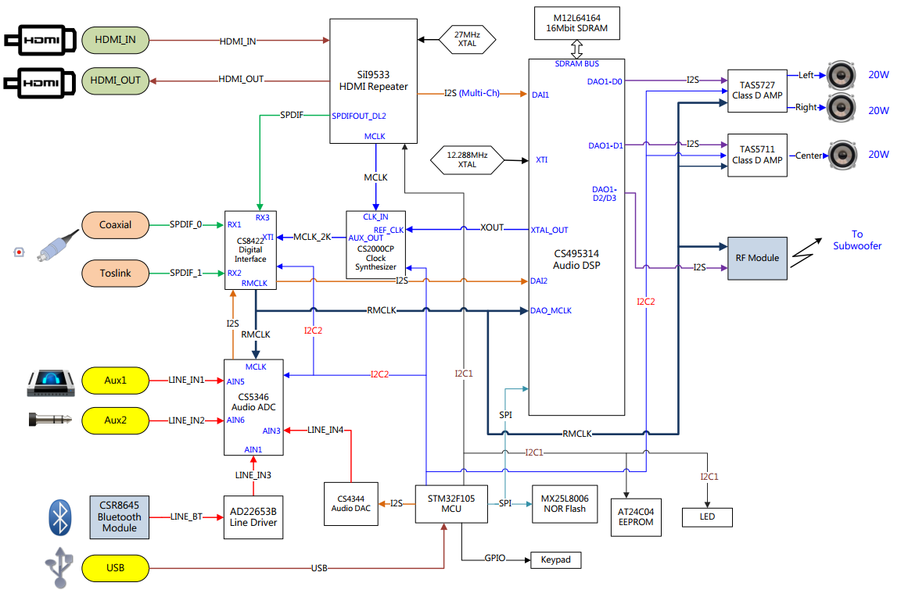

## 5.1 Audio System

## Design Material
+ Common connectivity
  I2C, RS-232/UART, SPI, ADC, I2S, GPIO. EXTI, TIMER
+ Bare-metal programming.
  MCU bootloader, USB pen driver and UART firmware upgrading.
+ RTOS Porting (FreeRTOS)
  Memory management, Mutexes, Multitasking, Message Queues, Interruption Management…etc.
+ Periphreal IC dirver design and implemenation.
  HDMI repeater, Audio CODEC, ADC, DAC, LED indicators, IR remote decode.
+ Assistant debug tool
  Experience in audio precision, digital multimeters, oscilloscope and logic analyzer.
+ Tracking System - Git, JIRA, Redmine

