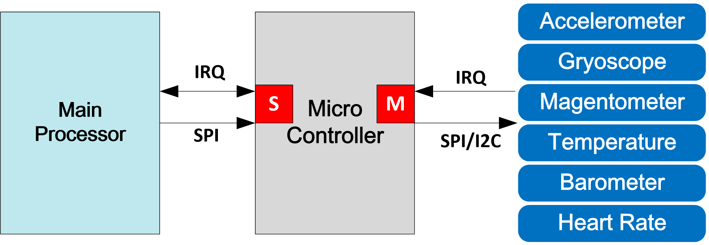
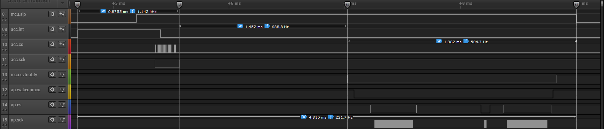
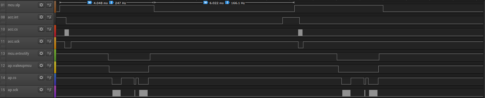
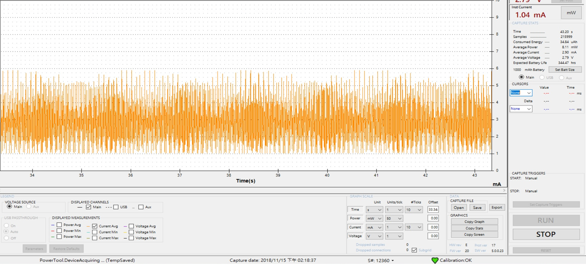
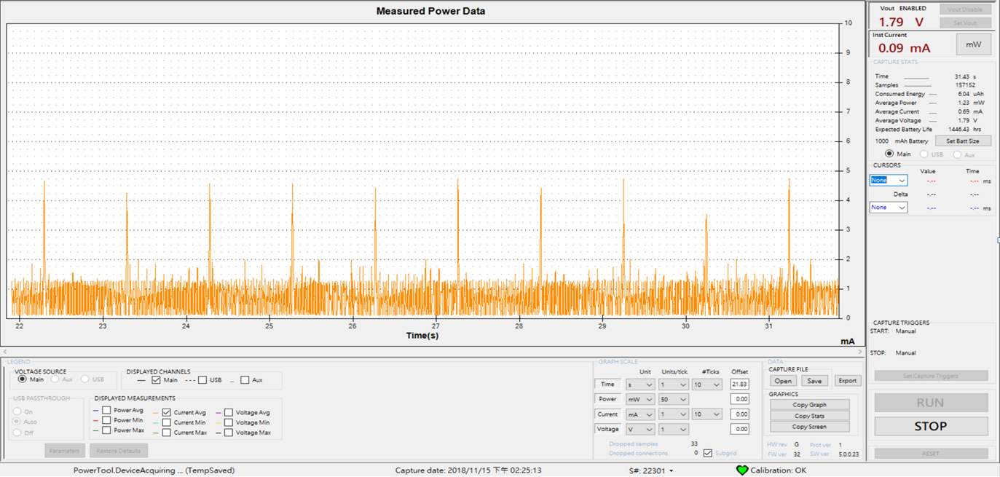
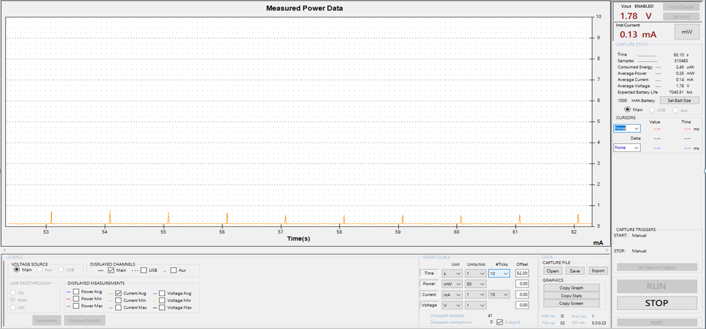

#
## IOT Product hardware architecture

## Key Points
+ MEMS sensors IRQ wakes up micro controller times.
+ MEMS sensor powered control mechanism.
+ Micro controller IRQ wakes up main processor times.
+ Micro controller API execution time.

## Measured micro controller active processing status with LA.

## Measured micro controller active and sleeping status duration time.

## Monitered power consumption with MEMS sensors

## Monitored power consumption with micro controller.

